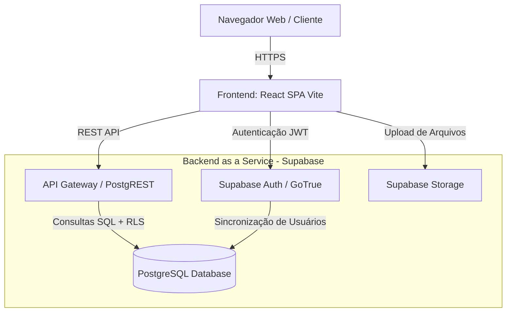
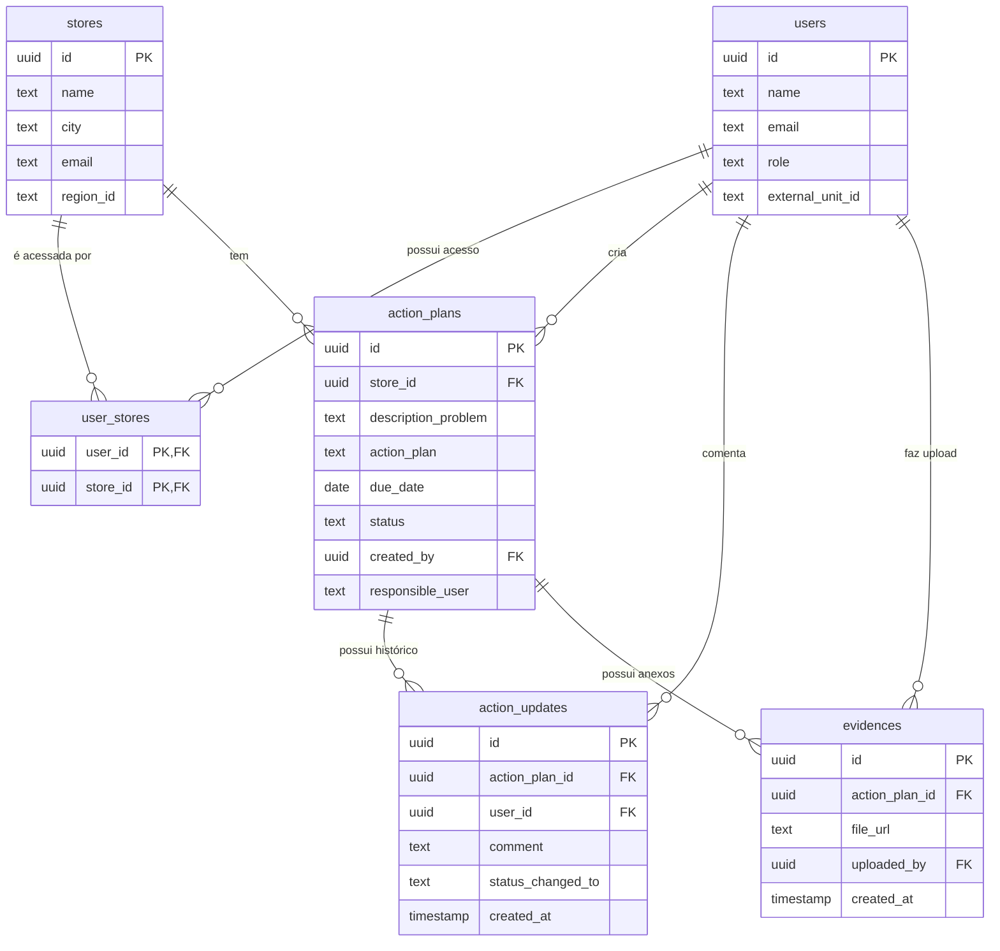
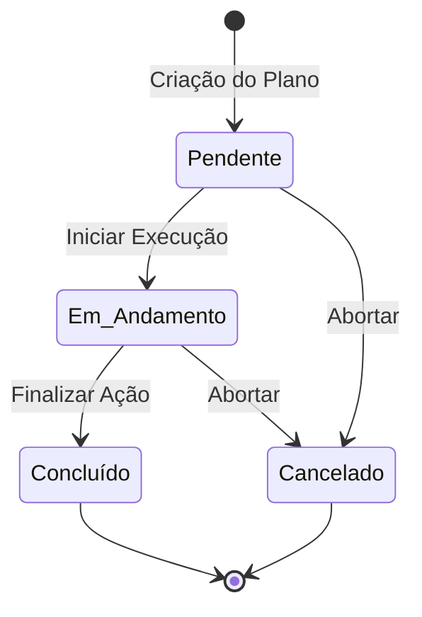
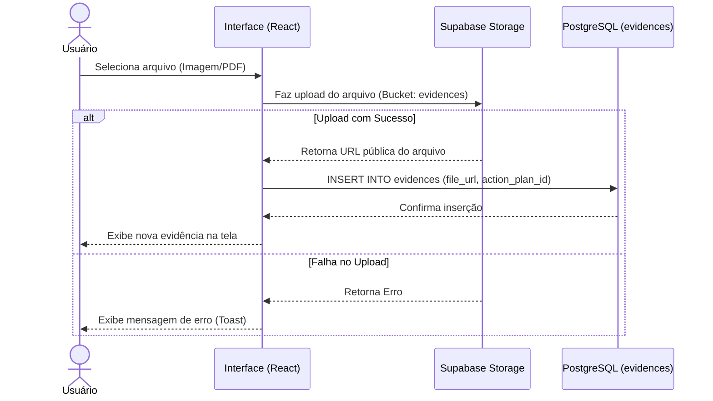

# 📄 Documentação Técnica: Sistema de Gestão de Planos de Ação

## 1. Visão Geral da Arquitetura
O sistema é uma aplicação web *Single Page Application* (SPA) baseada em uma arquitetura *Serverless*. O frontend gerencia a interface, estado e roteamento, comunicando-se diretamente com o Backend-as-a-Service (BaaS) via chamadas de API RESTful e WebSockets fornecidos pelo SDK do Supabase.

### Diagrama de Arquitetura (C4 Model - Nível de Container)



## 2. Stack Tecnológico
* **Frontend Core:** React 18, TypeScript, Vite (Bundler).
* **Roteamento:** React Router DOM v6.
* **Estilização e UI:** Tailwind CSS, Lucide React (Ícones).
* **Backend & Database:** Supabase (PostgreSQL 15+).
* **Autenticação:** Supabase Auth (Integração nativa com RLS).
* **Storage:** Supabase Storage (Buckets para armazenamento de evidências).

## 3. Modelo de Dados (Database Schema)

Abaixo está o Diagrama Entidade-Relacionamento (ERD) que ilustra a estrutura do banco de dados relacional.



## 4. Máquina de Estados: Planos de Ação

O ciclo de vida de um Plano de Ação segue um fluxo de status bem definido, conforme o diagrama de estados abaixo:



## 5. Segurança e Controle de Acesso (RBAC & RLS)

A segurança dos dados é garantida na camada do banco de dados através de **Row Level Security (RLS)** do PostgreSQL. Nenhuma requisição do frontend pode burlar essas regras.

### Matriz de Permissões (Roles)
| Entidade | Admin | Regional | Store |
| :--- | :--- | :--- | :--- |
| **Lojas** | CRUD Total | Leitura (Apenas vinculadas) | Leitura (Apenas a sua) |
| **Usuários** | CRUD Total | Sem acesso | Sem acesso |
| **Planos de Ação** | CRUD Total | CRUD (Apenas lojas vinculadas) | CRUD (Apenas sua loja) |
| **Evidências** | CRUD Total | Leitura/Escrita (Lojas vinculadas) | Leitura/Escrita (Sua loja) |

## 6. Fluxos de Dados Principais (Sequence Diagrams)

### 6.1. Fluxo de Upload de Evidências



## 7. Estrutura do Projeto Frontend (Diretórios)

O projeto segue uma arquitetura modular baseada em features e responsabilidades:

```text
src/
├── components/       # Componentes de UI reutilizáveis (Botões, Modais, Inputs)
├── lib/              # Configurações e integrações externas
│   ├── supabase.ts   # Instância do client do Supabase e tipagens (Interfaces)
│   └── AuthContext.tsx # Provedor de contexto de Autenticação global
├── pages/            # Componentes de nível de página (Rotas)
│   ├── Dashboard.tsx # Métricas e gráficos
│   ├── Home.tsx      # Listagem e filtros de planos de ação
│   ├── PlanDetails.tsx # View detalhada, timeline e upload de evidências
│   ├── Stores.tsx    # Gestão de lojas (Admin)
│   └── Users.tsx     # Gestão de usuários e vínculos (Admin)
├── App.tsx           # Configuração de Rotas (React Router) e Layout Base
├── index.css         # Diretivas do Tailwind e variáveis CSS globais
└── main.tsx          # Entry point da aplicação React
```

## 8. Variáveis de Ambiente
O sistema requer as seguintes variáveis configuradas no ambiente de deploy (Vercel, Netlify, etc) e no `.env` local:

```env
VITE_SUPABASE_URL=https://[PROJETO].supabase.co
VITE_SUPABASE_ANON_KEY=eyJh...[CHAVE_PUBLICA]
```
